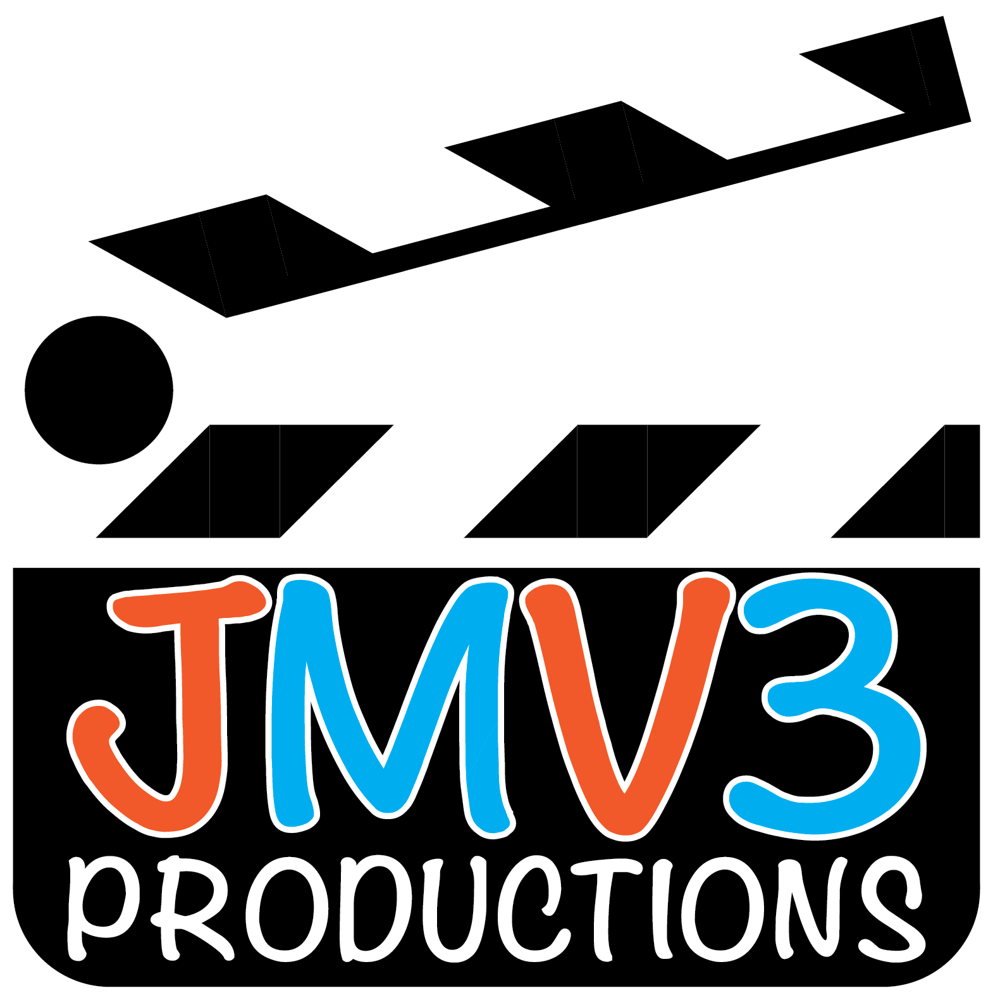

<h1 align="center">Hi 👋, I'm John Mason Vines III</h1>

<h3 align="center">Media Arts & Design Student at James Madison University</h3>

  

---

## About Me

I'm a student at **James Madison University** pursuing a Bachelor's degree in **Media Arts and Design**.

My interests combine **technology, media, photography, design, and digital content creation**. I enjoy working on projects that bring together creative design and technical development.

- 🎓 Studying Media Arts and Design at James Madison University
- 📸 Photographer and media creator
- 🎥 Experienced in media and content production
- 🥁 Work with the **JMU Marching Band Media Team**
- 🚀 Creator of **JMV3 Productions** and **JMV3 Galleries**

---

## My Work

### JMV3 Productions

My personal media and production brand, focusing on photography, digital media, and creative projects.

**Website:**  
<a href="https://www.jmv3productions.com/">jmv3productions.com</a>

### JMV3 Galleries

Photography galleries featuring events, performances, and other projects.

**Website:**  
<a href="https://www.jmv3galleries.com/">jmv3galleries.com</a>

---

## Contact

- **Email:** jmv3productions@gmail.com
- **Website:** <a href="https://www.jmv3productions.com/">JMV3 Productions</a>
- **Photography:** <a href="https://www.jmv3galleries.com/">JMV3 Galleries</a>

---

## Connect With Me

---

## Tools

---

  <i>Making Memories that Last a Life Time.</i>

